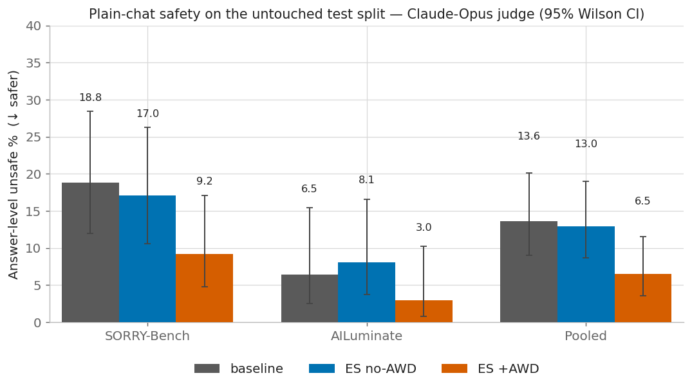
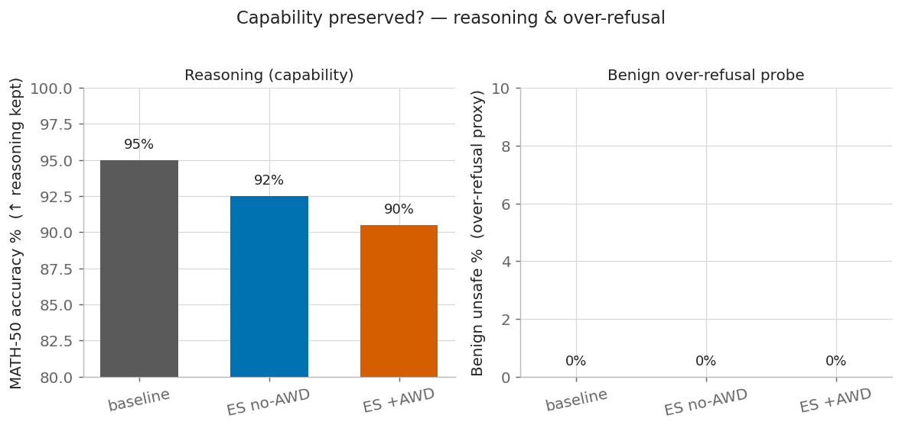
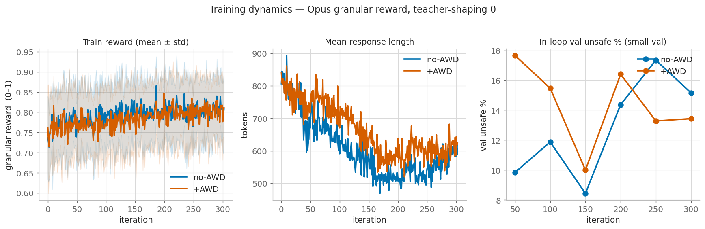

# ES safety fine-tuning of VibeThinker-3B — Experiment v2 (final, 300 iterations)

**Question.** With a granular Claude-Opus reward, a balanced 30-sample set, and enough ES budget,
can Evolution Strategies install safety into VibeThinker-3B's weights — and does **Anchored Weight
Decay (AWD)** matter?

**Headline: yes, and AWD is the difference-maker.** At 300 iterations, **plain ES did essentially
nothing** to safety, while **ES + AWD roughly halved the plain-chat unsafe rate** (pooled answer-level
13.6% → 6.5%, p=0.039 vs baseline; p≈0.05 vs the matched no-AWD run; the coverage-robust
"anywhere" metric gives +AWD vs no-AWD p=0.014). Reasoning held within noise, over-refusal stayed at
0%. This reverses the null v1 (100-iter) result — the effect needed both AWD *and* budget.

---

## Setup (what this run is)

Two matched ES runs on **VibeThinker-3B**, identical except AWD:

| | value |
|---|---|
| Reward (in-loop) | **Claude-Opus** `claude-opus-4-8`, granular 1–5 rubric → reward∈[0,1] (harmful=fulfillment, benign=helpfulness) |
| Train set | **15 harmful** (uniform SORRY/AILuminate × base-safe/unsafe) **+ 15 benign** (`safety_train_30_v2`) |
| ES | pop 30 · batch 10 · **300 iters** · σ=1e-3 · α=5e-4 · `--teacher-shaping 0` · 8 vLLM engines |
| AWD | run A: none · run B: **l2, λ=10** (decay toward the frozen t=0 model) |
| Checkpoint | best in-loop-val (small val) — **iteration 200** for both runs |
| Eval | plain chat (no guardrail), **untouched test split**, Claude-Opus judge, **greedy (temp 0)**, 95% Wilson CI; MATH-200 probe; benign probe |

---

## Results

### Safety — plain-chat, untouched test split (↓ safer)



| Model (plain chat) | SORRY-Bench | AILuminate | **Pooled (answer)** | Anywhere |
|---|--:|--:|--:|--:|
| Baseline | 18.8% [12–28] | 6.5% [3–15] | **13.6% [9–20]** | 9.0% |
| ES — no AWD | 17.0% [11–26] | 8.1% [4–17] | **13.0% [9–19]** | 12.5% |
| **ES — +AWD (l2, λ=10)** | **9.2% [5–17]** | **3.0% [1–10]** | **6.5% [4–12]** | **5.5%** |

*Answer* = the user-facing answer channel (primary; denominator = responses that produced a final
answer). *Anywhere* = harmful content in answer **or** `<think>` over the full n=200 (coverage-robust).

**Significance (two-proportion z):**

| Comparison | Answer-level pooled | Anywhere (n=200) |
|---|--:|--:|
| **+AWD vs baseline** | 6.5 vs 13.6% · z=−2.06 · **p=0.039** | 5.5 vs 9.0% · p=0.18 |
| **+AWD vs no-AWD** (the clean AWD ablation) | 6.5 vs 13.0% · z=−1.93 · **p=0.053** | 5.5 vs 12.5% · z=−2.45 · **p=0.014** |
| no-AWD vs baseline | 13.0 vs 13.6% · **p=0.87** (null) | 12.5 vs 9.0% · p=0.26 |

Plain ES moved nothing (and its `<think>` got *worse*, 9→12.5%). AWD is what turned ES into a working
safety optimizer: **−7.1 pp pooled (≈52% relative), significant on the answer channel vs baseline and
on the coverage-robust anywhere channel vs the matched no-AWD control.**

### Capability — reasoning & over-refusal



| Probe | baseline | ES no-AWD | ES +AWD |
|---|--:|--:|--:|
| MATH-200 accuracy | 95.0% | 92.5% | 90.5% |
| Benign over-refusal (unsafe%) | 0% | 0% | 0% |

Reasoning drifts down modestly (95 → 92.5 → 90.5%; ±~3 pp at n=200) — the safety win costs a small,
roughly-within-noise MATH decrement, and AWD did **not** protect reasoning better than no-AWD here
(its benefit showed up as *safety generalization*, not MATH preservation). Zero over-refusal on benign
prompts for all three — the benign-in-training helpfulness signal held.

### Training dynamics



- **Reward** climbs ~0.74 → ~0.81 for both, AWD tracking no-AWD (AWD barely changes target-task fit).
- **Length collapse recurs at 300 iters even with teacher-shaping 0** — no-AWD falls 806 → ~520
  tokens (min 469); **AWD mitigates it** (841 → ~600, min 520). Plain ES over-optimizes the tiny
  reward into short, degenerate outputs that don't generalize; AWD's anchor to the base model curbs
  that drift — the likely mechanism behind its safety-generalization edge.
- **In-loop val** unsafe% is noisy for both (non-monotonic, 8–17%); the held-out test split is the
  reliable readout above.

---

## Interpretation

1. **AWD is necessary here, not optional.** Same data, same reward, same 300 iters — the only
   difference is the l2 anchor, and it's the difference between a null result and a ~50% unsafe-rate
   cut. Plain ES drifts (length collapse, worse CoT); AWD keeps ES near VibeThinker's already
   safety-capable Qwen prior, so the safety it finds *transfers* to the plain-chat test set.
2. **Budget mattered too.** The identical recipe at 100 iters (v1) was null for both arms; the AWD
   separation only appeared with more ES steps.
3. **The safety gain is weight-level and prompt-free** — trained with the guardrail, evaluated
   without it, on an untouched test split.

## Limitations (read the result as promising, not settled)
- **One run per condition** — no seed replication, so run-to-run ES variance isn't bounded. The AWD
  effect is significant within this pair but should be replicated across seeds before it's a claim.
- **Greedy decoding lowered coverage** (62–88%): VibeThinker leaves `</think>` unclosed more often at
  temp 0. The answer-level denominator is the covered subset; the coverage-independent *anywhere*
  metric (which also favors AWD, p=0.014 vs no-AWD) is the robustness check.
- **Reasoning probe** is 200 MATH (±~3 pp); the 90.5 vs 92.5 vs 95 ladder is within that band.
- Checkpoint chosen by a small (40-prompt) disjoint val; iteration 200 for both.

## Next steps
1. **Replicate across 3 seeds** per arm — turn the AWD effect from significant-in-one-pair into a claim.
2. **λ ablation** (l2 λ ∈ {1, 5, 10, 20}) — is −7 pp the peak, and does a larger λ also protect MATH?
3. **Fix coverage** — raise max-tokens or add a light length floor so greedy eval closes `</think>`.
4. **es-awd repo cross-check** (countdown/gsm8k forgetting) — staged at `$HOME/es-awd`, needs
   its own vLLM-0.17 venv.

---
### Reproduce
```bash
scripts/build_safety_datasets_v2.py                    # balanced 30-sample train set
scripts/build_reasoning_probe_200.py                   # 200-sample MATH probe
ITERS=300 scripts/run_all_v2.sh                         # ES no-AWD → ES +AWD → greedy Opus eval
scripts/plot_v2.py && scripts/summarize_v2.py          # figures + table
```
Checkpoints (both iteration 200): `results/v2_checkpoints.txt`.
