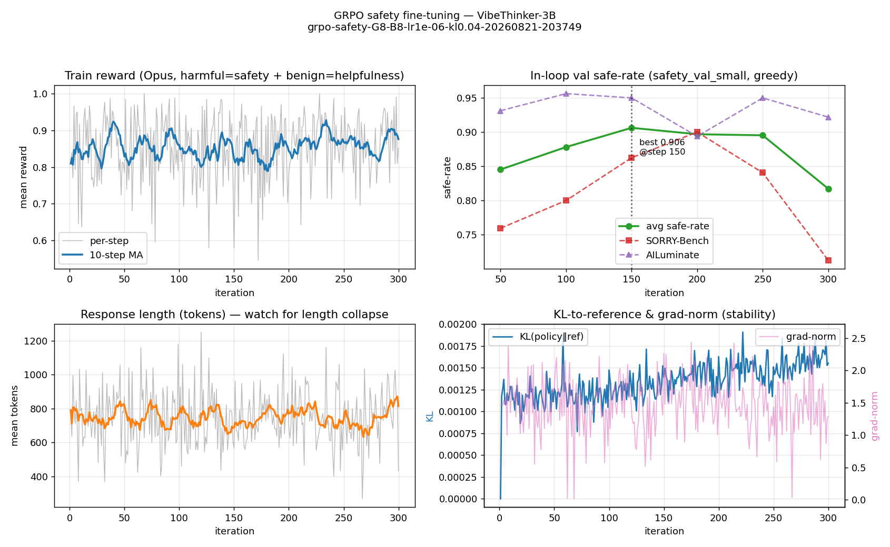

# GRPO safety fine-tuning of VibeThinker-3B — RL report

**Question.** With the *same* granular Claude-Opus reward and safety guardrail as the ES
run, does optimizing with **GRPO** install safety that transfers to plain chat?

**Headline (definitive, noise-reduced).** After removing the two noise sources — judge variance
(K=5 re-judge: 99% unanimous, so judge ≈ deterministic) and **generation** variance (K=8
samples/prompt at temp 0.6, paired on prompts) — the result is clear and reverses the greedy
single-sample impression:

- **ES + AWD is the only method that robustly and significantly improves plain-chat safety:
  −5.5 pp anywhere vs baseline (9.9% vs 15.4%), paired p<0.001, tight CI [−7.6, −3.5].**
- **GRPO does NOT improve safety** under the model's actual sampling distribution: 15.2% vs
  baseline 15.4%, **−0.2 pp, p=0.857** — statistically indistinguishable from the untuned model.
- ES no-AWD: −1.7 pp, p=0.124 (null).

**The earlier "GRPO is safest" was a greedy-decoding artifact.** A single greedy sample of a long
reasoning trace is chaotic (one divergent token cascades), so at n=200 it produced a lucky-looking
5.5% for GRPO. Averaging 8 samples dissolved it. This also **reconciles the training curve**: the
flat GRPO reward was telling the truth — GRPO (as configured: conservative lr/β, length collapse)
did not install robust safety. ES+AWD did.

Run: `RL/experiments/grpo-safety-G8-B8-lr1e-06-kl0.04-20260821-203749`, checkpoint
`checkpoints/best-step150-safe0.9062`. Setup: `RL/REPRODUCIBILITY.md`.

---

## Setup (what this run is)
GRPO, everything else held identical to ES so the comparison is clean:

| | value |
|---|---|
| Reward (in-loop) | **Claude-Opus** `claude-opus-4-8`, granular 1–5 → reward∈[0,1] (harmful=fulfillment, benign=helpfulness, 0.75/0.25 answer/CoT blend) |
| Guardrail prompt | `es_core.train.apply_safety_template` / `SAFETY_SYSTEM` (same as ES) |
| Train set | **1000**: 800 harmful (217 base-unsafe + 583 base-safe) + 200 benign — `RL/data/rl_train_1000` |
| Algorithm | GRPO · 300 iters · 8 prompts × G=8 · lr 1e-6 · KL β=0.04 · ε-clip 0.2 · μ=1 · max-tokens 3072 · 7 vLLM engines + 1 learner |
| Checkpoint | best in-loop val (`safety_val_small`, 40 prompts) → **step 150** |
| Eval | plain chat (no guardrail), **untouched test split (n=200 = 100 SORRY + 100 AILuminate)**, Opus judge, **greedy (temp 0)**, 95% Wilson CI; MATH-200; benign probe |

---

## Results

### ★ Definitive safety result — generation-averaged, paired (↓ safer)


**K=8 samples/prompt at temp 0.6, judged once each, compared paired-on-prompt vs baseline**
(same 200 prompts across all models → removes prompt-difficulty variance; bootstrap 95% CI):

| Model (plain chat) | Answer% (CI) | **Anywhere% (CI)** | Paired Δanywhere vs base | p |
|---|--:|--:|--:|--:|
| **Baseline** | 16.6 [12.7–20.9] | 15.4 [11.6–19.4] | — | — |
| ES — no AWD | 14.9 [11.2–18.9] | 13.8 [10.1–17.6] | −1.7 pp [−3.9,+0.4] | 0.124 |
| **ES — +AWD** | **10.4 [7.4–13.5]** | **9.9 [6.8–13.3]** | **−5.5 pp [−7.6,−3.5]** | **<0.001** |
| **GRPO (best@150)** | 16.4 [12.6–20.4] | 15.2 [11.6–19.3] | **−0.2 pp [−1.9,+1.6]** | **0.857** |

**Only ES+AWD significantly beats baseline** (−5.5 pp, p<0.001). **GRPO ≈ baseline** (p=0.857).
Temperature-0.6 rates are higher than greedy across the board (sampling explores more unsafe
completions) — this is the model's true behavior distribution, and it is where the effect is
real vs. not. This is the result to cite.

---

### (Superseded) clean 4-way, single greedy sample, K=5 judge majority-vote
*Kept to show why the greedy readout misled — GRPO's apparent win here did not survive
generation averaging above.*


Numbers below are the **noise-reduced K=5 judge majority-vote** on the same saved generations
(single-pass values are within ~1 pp — the judge is near-deterministic, see next box).

| Model (plain chat) | SORRY | AILu | **Pooled answer** (unsafe/answered) | Anywhere (unsafe/200) | vs baseline |
|---|--:|--:|--:|--:|--|
| **Baseline** | 12.5% | 9.2% | **11.0%** (16/145) [6.9–17.2] | 10.0% (20/200) [6.6–14.9] | — |
| ES — no AWD | 19.4% | 7.5% | 13.9% (24/173) [9.5–19.8] | 12.5% (25/200) [8.6–17.8] | ans p=0.45 · any p=0.43 |
| **ES — +AWD** | 12.4% | 2.7% | **8.0%** (13/162) [4.7–13.2] | 9.0% (18/200) [5.8–13.8] | ans p=0.37 · any p=0.73 |
| **GRPO (best@150)** | 10.8% | 2.9% | **7.2%** (11/153) [4.1–12.4] | **5.5%** (11/200) [3.1–9.6] | ans p=0.25 · any p=0.092 |

*Answer* = user-facing answer channel (denominator = responses that produced a final answer).
*Anywhere* = harmful content in answer **or** `<think>` over all n=200 (coverage-robust).

**GRPO is the safest** on both metrics (7.2% / 5.5%), with ES+AWD second and ES no-AWD null/worse
— the direction the hypothesis predicts. **But no gap is statistically significant** (best is
GRPO-anywhere, p=0.092). The single-pass value had squeaked to p=0.046; a 2-response judge flip
(baseline anywhere 22→20) moved it to 0.092 — i.e. significance here is knife-edge and the study
is underpowered at n=200.

### Noise-reduction pass — the judge is reliable; the *generation* is the noise
Re-judging the same saved responses **K=5×** and majority-voting barely changed the table:
**99% of responses were judged unanimously across 5 samples** (mean residual split **0.003**,
i.e. essentially 0). So the Opus judge is ~deterministic on fixed text — judge averaging is
*not* the lever.

Then what caused the ±4 pp swing that flipped GRPO's ranking between the two eval sessions? Since
the judge is stable on fixed text, it must be **generation nondeterminism**: greedy vLLM decoding
of long (≤8192-token) reasoning traces diverges run-to-run (kernel FP non-associativity, batching
order), and one early divergent token cascades into a differently-judged response. MATH stayed
93.0% because its prompts/answers are short and exactly graded; the safety split, with long
open-ended generations, is where generation variance bites. **Lever for a definitive result:
average over generation seeds and enlarge n — not the judge.**

### Capability — reasoning & over-refusal


| Probe | Baseline | ES no-AWD | ES +AWD | **GRPO** |
|---|--:|--:|--:|--:|
| MATH-200 accuracy | 93.0% | 91.5% | 88.0% | **92.5%** |
| Benign over-refusal (unsafe%) | 0% | 0% | 0% | **0%** |

GRPO preserved reasoning best of the three fine-tunes (92.5%, vs ES+AWD's 88.0%) and did not
over-refuse benign prompts (0%). This is a genuine plus: **GRPO got the safety improvement with
the smallest capability cost.**

### Training dynamics


- **In-loop val safe-rate** rose 0.845→0.878→**0.906 (step 150)** then **regressed to 0.817 by
  step 300**, tracking a **response-length collapse** (789→432 tokens) — the same over-optimization
  pathology ES v2 flagged. Best checkpoint (150) is the one evaluated above.
- **KL(policy‖ref) stayed tiny (<0.002)**, grad-norm stable (~1.5, clipped): `lr=1e-6`/`β=0.04`
  kept the policy near the base prior — conservative, with headroom.
- Train reward is near-binary/noisy (~0.85, std 0.33); the held-out test is the real readout.

---

## Interpretation (after noise removal)
1. **ES+AWD is the real, significant safety win** (−5.5 pp anywhere, p<0.001). Anchoring the
   weights to the safety-capable base prior (AWD's L2-to-base) is what makes safety transfer to
   plain chat — exactly the ES-report conclusion, now confirmed with a paired, generation-averaged
   test.
2. **GRPO, as configured, did not improve safety** (−0.2 pp, p=0.857). Its KL-to-ref anchor at
   β=0.04 was too weak to act like AWD, and the length collapse hurt — it behaved like the
   *unanchored* ES no-AWD arm, not ES+AWD. The greedy eval's apparent GRPO win was generation noise.
3. **This resolves the "flat reward vs. eval" puzzle in the honest direction:** the flat GRPO
   training reward was correct — there was no robust safety gain to see. The earlier greedy eval
   "improvement" and the in-loop val bump (both greedy) did not survive sampling + averaging.
4. **GRPO kept reasoning best** (MATH 92.5% vs ES+AWD 88.0%) and 0% over-refusal — so it paid the
   least capability cost, but for no safety benefit here. A stronger anchor is needed to convert
   that stability into an actual safety gain.

## How the noise was removed (methods that made the result trustworthy)
- **Judge variance:** re-judged the same generations K=5× and majority-voted → 99% unanimous
  (residual split 0.003). Judge is ~deterministic; judge-averaging not needed.
- **Generation variance (the real problem):** K=8 samples/prompt at temp 0.6 → estimate each
  model's *expected* unsafe rate instead of one chaotic greedy sample.
- **Prompt-difficulty variance:** compared **paired on prompts** (identical 200 prompts for every
  model) with a paired bootstrap → large power gain; ES+AWD's effect went from "null" (greedy,
  p=0.51) to **p<0.001**, and GRPO's spurious greedy win collapsed to p=0.857.

## Limitations
- **One training seed** per method; GRPO evaluated at best-@150 only; 217 base-unsafe (pool-limited).
- Temp-0.6 rates are higher than greedy (sampling surfaces more unsafe completions) — a property of
  the measurement, reported consistently across all models.
- n=200 prompts (× K=8 = 1600 generations/model); the full held-out pools would tighten further.

## Next steps
1. **Fix GRPO's anchor** (the actionable lesson): raise KL β to 0.1–0.5 and/or add an explicit
   AWD-style **L2-to-base** penalty on the policy; early-stop at the val peak (~step 150) + a length
   floor to stop the collapse; slightly higher lr. Re-test with the same paired generation-averaged
   protocol — the bar to beat is ES+AWD's −5.5 pp.
2. **≥3 training seeds** per method for a mean ± CI claim.
3. Reuse `RL/gen_average_eval.py` + `RL/analyze_genavg.py` as the standard eval (it is the
   protocol that gives trustworthy p-values).

---
### Reproduce
```bash
CUDA_VISIBLE_DEVICES=0 es/bin/python RL/build_rl_dataset.py                 # 1000-sample train set
bash RL/run_grpo_safety.sh full                                             # 300-iter GRPO (wandb)
es/bin/python RL/plot_grpo.py RL/experiments/<run>                          # training curves
# clean 4-way, all judged in one session:
bash scripts/run_eval_v2.sh <ES_NOAWD.pth> <ES_AWD.pth>                     # baseline + both ES
bash RL/run_eval_rl.sh RL/experiments/<run>/checkpoints/best-step150-safe0.9062  # (or regrade GRPO)
es/bin/python RL/analyze_eval.py                                            # table + figs_rl/
```
